Independent Component Analysis: Underlying Source Signals in TV images
-------------------
1.  [Problem Description](#problem-description)
2.  [How many independent sources make up the
    signal?](#how-many-independent-sources-make-up-the-signal)
    -   [k=2](#k2)
    -   [k=3](#k3)
    -   [k=4](#k4)
    -   [k=5](#k5)
    -   [k=6](#k6)
    -   [k=7](#k7)
    -   [k=11](#k11)
3.  [Number of independent sources that make up the
    signal](#number-of-independent-sources-that-make-up-the-signal)

Problem Description
-------------------

The goal is find the underlying source signals (images) that might be
making up the 1,000 noisy images contained in these data. It is unknown
how many channels were being mixed, so we have to look at several
choices for the number of independent components to consider.

Data are in the data frame TVimages in TVimages.RData provided by
Dr. Brant Deppa.

Libraries needed: ica and fastICA.

Function to plot TV images.

``` r
TV.plot = function(temp,i) {image(1:225,1:225,matrix(temp[,i],225,225),col=gray((0:225/225)))}
```

``` r
#Setting plotting parameters
par(mfrow=c(2,2),mar=c(0,0,0,0),xaxt="n",yaxt="n")
#Plotting 4 images
for (i in 1:4) {TV.plot(TVimages,i)}
```

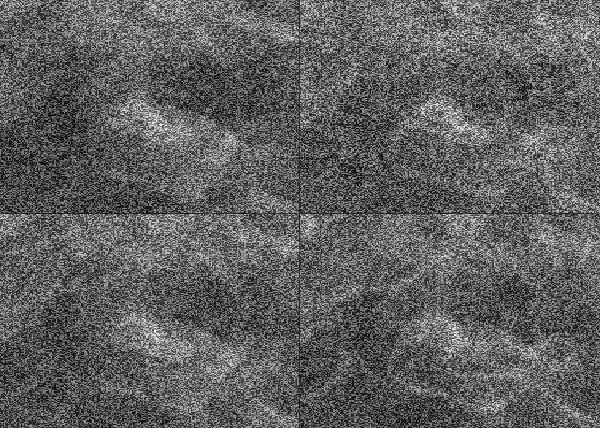

How many independent sources make up the signal?
------------------------------------------------

Finding out how many channels were being mixed by looking at several
choices for the number of independent components, k.

### k=2

``` r
Results2 = fastICA(TVimages,n.comp=2)
attributes(Results2)
```

    ## $names
    ## [1] "X" "K" "W" "A" "S"

The estimated sources images are contained in the columns of the matrix
50,2625×k matrix S.  
To view them as images, use the image command as shown below.

If the image looks like the dark and light pixels are inverted, use 1 -
matrix(results$S\[,j\],225,225) as the third argument to the image
function.

``` r
par(mfrow=c(1,2),mar=c(0,0,0,0), xaxt = "n", yaxt="n")
#Plotting the image where j is replaced by the estimated source signal you want to view.
#image(1:225, 1:225, matrix(Results2$S[,j],225,225),col=gray((0:225/225)))
image(1:225, 1:225, matrix(1-Results2$S[,1],225,225),col=gray((0:225/225)))
image(1:225, 1:225, matrix(1-Results2$S[,2],225,225),col=gray((0:225/225)))
```

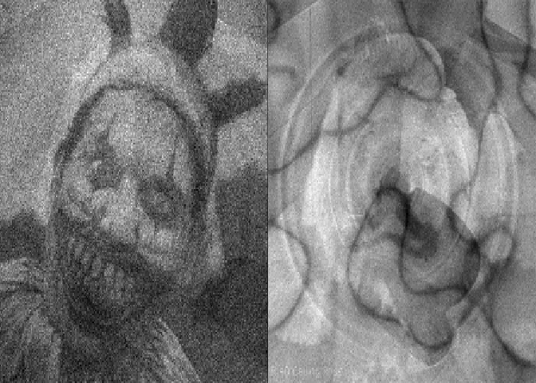

### k=3

``` r
Results3 = fastICA(TVimages,n.comp=3)
```

``` r
par(mfrow=c(1,3),mar=c(0,0,0,0), xaxt = "n", yaxt="n")
image(1:225, 1:225, matrix(Results3$S[,1],225,225),col=gray((0:225/225)))
image(1:225, 1:225, matrix(Results3$S[,2],225,225),col=gray((0:225/225)))
image(1:225, 1:225, matrix(Results3$S[,3],225,225),col=gray((0:225/225)))
```

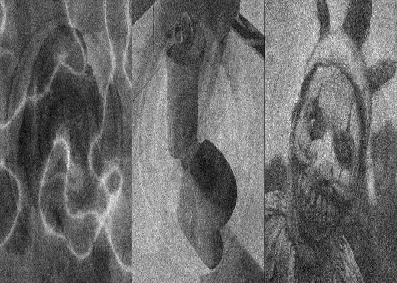

### k=4

``` r
Results4 = fastICA(TVimages,n.comp=4)
```

``` r
par(mfrow=c(2,2),mar=c(0,0,0,0), xaxt = "n", yaxt="n")
image(1:225, 1:225, 1- matrix(Results4$S[,1],225,225),col=gray((0:225/225)))
image(1:225, 1:225, 1- matrix(Results4$S[,2],225,225),col=gray((0:225/225)))
image(1:225, 1:225, matrix(Results4$S[,3],225,225),col=gray((0:225/225)))
image(1:225, 1:225, matrix(Results4$S[,4],225,225),col=gray((0:225/225)))
```

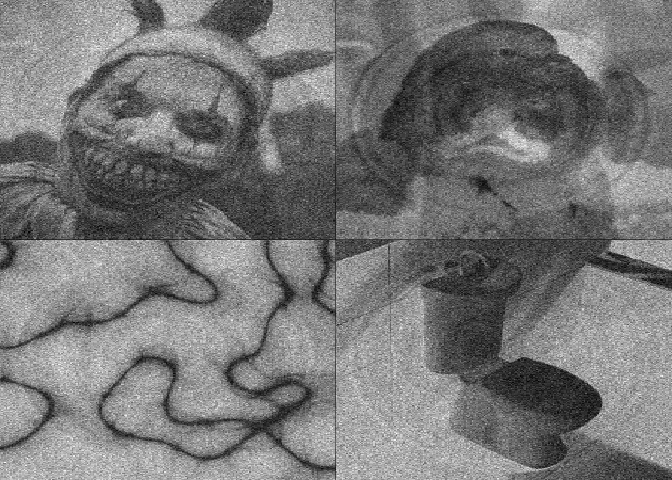

### k=5

``` r
Results5 = fastICA(TVimages,n.comp=5)
```

``` r
par(mfrow=c(3,2),mar=c(0,0,0,0), xaxt = "n", yaxt="n")
image(1:225, 1:225, 1- matrix(Results5$S[,1],225,225),col=gray((0:225/225)))
image(1:225, 1:225, matrix(Results5$S[,2],225,225),col=gray((0:225/225)))
image(1:225, 1:225, matrix(Results5$S[,3],225,225),col=gray((0:225/225)))
image(1:225, 1:225, matrix(Results5$S[,4],225,225),col=gray((0:225/225)))
image(1:225, 1:225, matrix(Results5$S[,5],225,225),col=gray((0:225/225)))
```

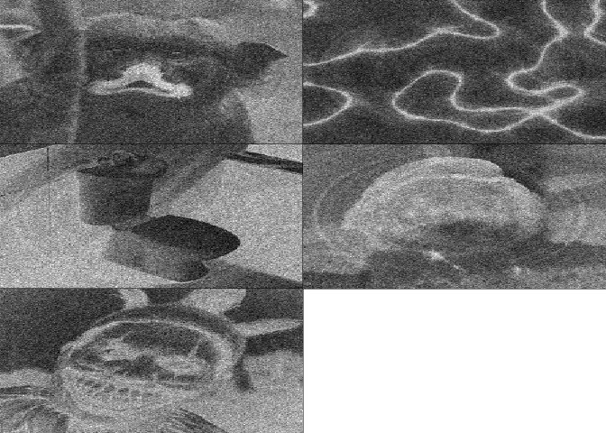

### k=6

``` r
Results6 = fastICA(TVimages,n.comp=6)
```

#### Image j=1

``` r
par(mfrow=c(1,2),mar=c(0,0,0,0), xaxt = "n", yaxt="n")
image(1:225, 1:225, matrix(Results6$S[,1],225,225),col=gray((0:225/225)))
image(1:225, 1:225, matrix(1-Results6$S[,1],225,225),col=gray((0:225/225)))
```

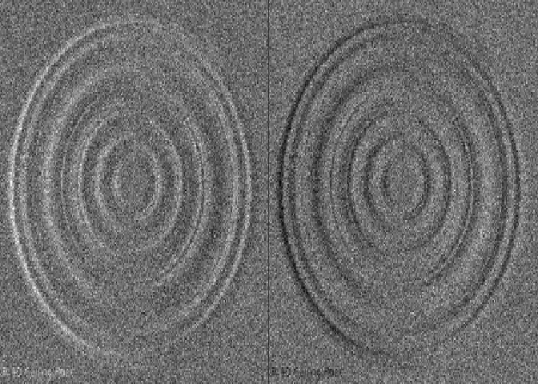

#### Image j=2

``` r
par(mfrow=c(1,2),mar=c(0,0,0,0), xaxt = "n", yaxt="n")
image(1:225, 1:225, matrix(Results6$S[,2],225,225),col=gray((0:225/225)))
image(1:225, 1:225, matrix(1-Results6$S[,2],225,225),col=gray((0:225/225)))
```

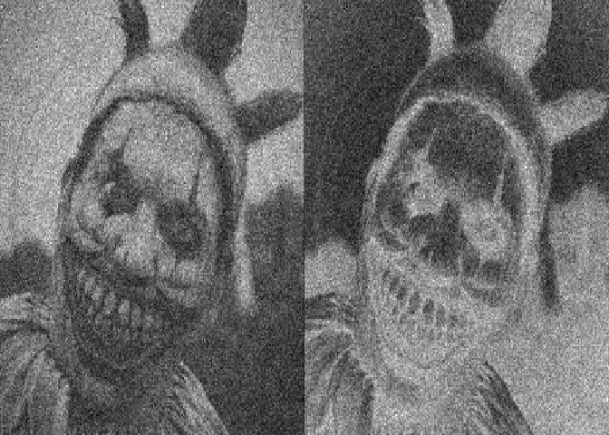

#### Image j=3

``` r
par(mfrow=c(1,2),mar=c(0,0,0,0), xaxt = "n", yaxt="n")
image(1:225, 1:225, matrix(Results6$S[,3],225,225),col=gray((0:225/225)))
image(1:225, 1:225, matrix(1-Results6$S[,3],225,225),col=gray((0:225/225)))
```

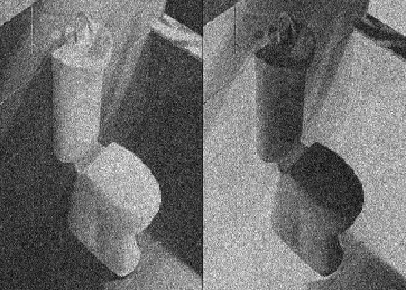

#### Image j=4

``` r
par(mfrow=c(1,2),mar=c(0,0,0,0), xaxt = "n", yaxt="n")
image(1:225, 1:225, matrix(Results6$S[,4],225,225),col=gray((0:225/225)))
image(1:225, 1:225, matrix(1-Results6$S[,4],225,225),col=gray((0:225/225)))
```

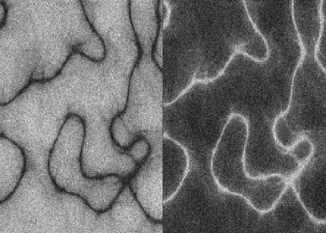

#### Image j=5

``` r
par(mfrow=c(1,2),mar=c(0,0,0,0), xaxt = "n", yaxt="n")
image(1:225, 1:225, matrix(Results6$S[,5],225,225),col=gray((0:225/225)))
image(1:225, 1:225, matrix(1-Results6$S[,5],225,225),col=gray((0:225/225)))
```

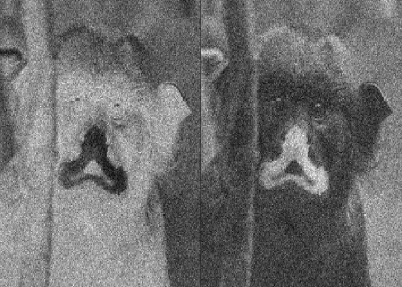

#### Image j=6

``` r
par(mfrow=c(1,2),mar=c(0,0,0,0), xaxt = "n", yaxt="n")
image(1:225, 1:225, matrix(Results6$S[,6],225,225),col=gray((0:225/225)))
image(1:225, 1:225, matrix(1-Results6$S[,6],225,225),col=gray((0:225/225)))
```

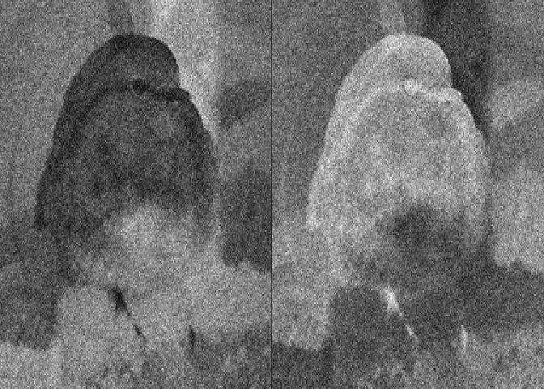

### k=7

``` r
Results7 = fastICA(TVimages,n.comp=7)
```

``` r
par(mfrow=c(2,4),mar=c(0,0,0,0), xaxt = "n", yaxt="n")
image(1:225, 1:225, matrix(1-Results7$S[,1],225,225),col=gray((0:225/225)))
image(1:225, 1:225, matrix(1-Results7$S[,2],225,225),col=gray((0:225/225)))
image(1:225, 1:225, matrix(Results7$S[,3],225,225),col=gray((0:225/225)))
image(1:225, 1:225, matrix(1-Results7$S[,4],225,225),col=gray((0:225/225)))
image(1:225, 1:225, matrix(Results7$S[,5],225,225),col=gray((0:225/225)))
image(1:225, 1:225, matrix(1-Results7$S[,6],225,225),col=gray((0:225/225)))
image(1:225, 1:225, matrix(Results7$S[,7],225,225),col=gray((0:225/225)))
```

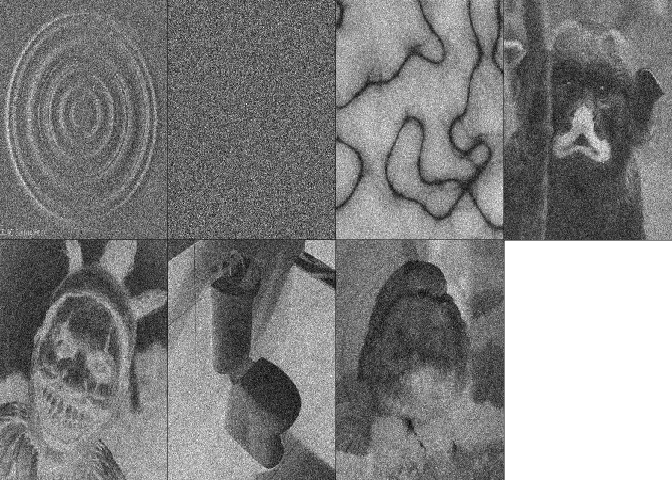

### k=11

``` r
Results11 = fastICA(TVimages,n.comp=11)
```

``` r
par(mfrow=c(3,4),mar=c(0,0,0,0), xaxt = "n", yaxt="n")
image(1:225, 1:225, matrix(Results11$S[,1],225,225),col=gray((0:225/225)))
image(1:225, 1:225, matrix(1-Results11$S[,2],225,225),col=gray((0:225/225)))
image(1:225, 1:225, matrix(Results11$S[,3],225,225),col=gray((0:225/225)))
image(1:225, 1:225, matrix(1-Results11$S[,4],225,225),col=gray((0:225/225)))
image(1:225, 1:225, matrix(Results11$S[,5],225,225),col=gray((0:225/225)))
image(1:225, 1:225, matrix(Results11$S[,6],225,225),col=gray((0:225/225)))
image(1:225, 1:225, matrix(Results11$S[,7],225,225),col=gray((0:225/225)))
image(1:225, 1:225, matrix(Results11$S[,8],225,225),col=gray((0:225/225)))
image(1:225, 1:225, matrix(1-Results11$S[,9],225,225),col=gray((0:225/225)))
image(1:225, 1:225, matrix(1-Results11$S[,10],225,225),col=gray((0:225/225)))
image(1:225, 1:225, matrix(Results11$S[,11],225,225),col=gray((0:225/225)))
```

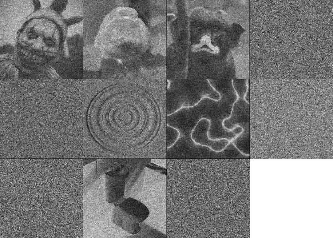

#### Number of independent sources that make up the signal

There are <b>k=6</b> independent sources that are making up the
massively distorted signal.
